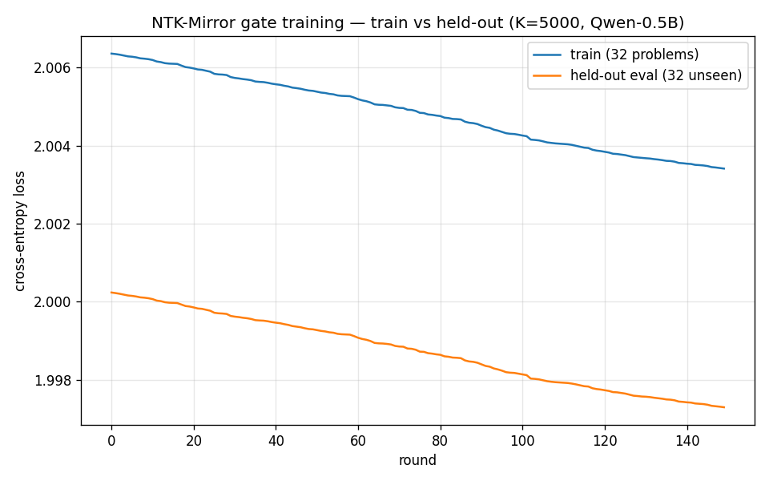

# Phase 40 learning run — result

- **Corpus:** 32 train / 32 held-out 2-digit-addition problems (disjoint, carry format — no task-shift from the gate-selection corpus).
- **Gates:** K=5000 on frozen Qwen2.5-0.5B-Instruct, SPSA tournament on the deployed coordinator.
- **Rounds:** 300 verifier iterations → 150 server-applied updates (single worker = half rate; see regime note).
- **Wall clock / η / θ:** 41 min on a Kaggle T4; η frozen at 1e-3 throughout; ‖θ‖ grew 0 → 0.127.

| metric | start | final | Δ | relative |
|---|---|---|---|---|
| train loss (32 problems) | 2.0064 | 2.0034 | −0.0030 | ~0.15% |
| held-out eval loss (32 unseen) | 2.0002 | 1.9973 | −0.0029 | ~0.15% |

**Verdict (honest read).** Held-out loss decreases **monotonically, in lockstep with train, with no
overfitting gap** — a genuine generalisation signal, since the eval problems were never trained on.
**But the magnitude is small (~0.003 nats, ~0.15%)**, and the curve is **still descending at round 150
— not converged.** The smallness reflects the *regime*, not a capacity wall: only 150 gate updates,
η pinned at 1e-3 (sym-AIMD never fires with a single honest worker — no audits close, the documented
degenerate regime), and noisy SPSA at K=5000. The claim this run supports is precise and limited:
*the federated gate-controller generalises to unseen same-distribution problems*, not *it learns a
large amount*. A full-rate ≥2-honest-worker run (η-adaptation on) is the path to a steeper, larger drop.

*Reproduce: `notebooks/phase40_learning_run_kaggle.ipynb`. Raw per-round data: `trajectory.csv`; full run trail: `run.log`.*
