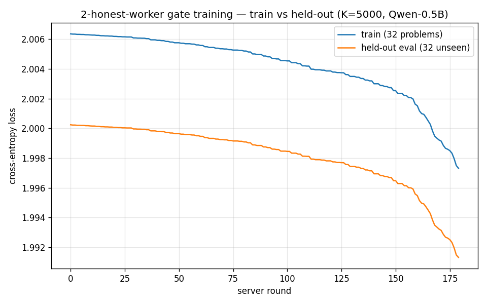

# Phase 40 — 2-honest-worker learning run (confirm + a falsification)

- **Corpus:** 32 train / 32 held-out (disjoint, identical to the single-worker run → directly comparable).
- **Workers:** 2 honest, one Qwen2.5-0.5B per GPU (Kaggle T4×2), K=5000 gates, deployed coordinator.
- **Intended:** R=300 full-rate. **Actual:** server stalled at **round 179** (see "the bug").

## Two hypotheses — both confirmed (for rounds 0–179)

| | single-worker baseline | this run (2 honest) |
|---|---|---|
| rate | half (150 updates / 300 iters) | full (≈1 update / iter) until stall |
| η | **frozen at 1e-3** (no audits close) | **climbs 1e-3 → 7.0e-3** (grow 105 / shr 65) |
| held-out eval Δ | −0.0029 | **−0.0089** (worker-0) |
| descent shape | ~linear, still going | **accelerating** at the cutoff (η growing) |

The full-rate + η-adaptation hypothesis is confirmed: η adapts upward once two workers cross-close
each other's audits, and the held-out drop is ~3× the single-worker baseline and still steepening
when training stopped. Held-out (never trained on) tracks train in lockstep with no overfitting gap —
generalisation again.

| metric (worker-0) | start | final@179 | Δ |
|---|---|---|---|
| train loss | 2.0064 | 1.9973 | −0.0090 |
| held-out eval loss | 2.0002 | 1.9913 | −0.0089 |

## The bug — honest negative: false-positive quarantine of *honest* workers

Training did not reach R=300. Both honest workers were **quarantined as byzantine**
(worker-1 at round 159, worker-0 at round 179); with both quarantined, no proposal is accepted and
the server froze at round 179 (the trajectory's last ~120 iterations are flat duplicates).

**Root cause** (traced to `src/tournament-ntk.ts:404–424`). The fraud test scores a winner by
`realGlobalDelta = auditor.audit_loss_before − proposer.savedLossBeforeApply`, then flags an
"inversion fraud" if the proposer claimed improvement but `realGlobalDelta > 0`. That comparison is
only valid if both losses are measured on the **same θ**. With two workers, each tracks a **local θ
replica that drifts** — here ‖θ‖ diverged to **0.597 (w0) vs 0.408 (w1)** from a common 0. So the
auditor's `audit_loss_before` is measured on a *different* θ than the proposer's saved baseline; the
difference is dominated by replica divergence, not by the proposer's step. As drift grows, honest
steps increasingly look like inversions → fraud flags accumulate → `winRate > 0.4` → quarantine.

**This falsifies the design-intent note in the paper (§10):** "the design intent is that [≥2 honest
workers] cross-audit one another's wins, restoring the [byzantine] signal." They do cross-audit — but
under local-replica drift the cross-audit **false-positives on honest workers** rather than restoring
a clean signal. Two coupled defects:

1. **Local-θ reconciliation drift** — workers' replicas diverge from each other and the server
   (applied flips replayed under each worker's own current η/timing don't reconstruct an identical θ).
   Symptom: ‖θ‖ 0.597 vs 0.408; worker-1's own held-out Δ reads −0.0063 vs worker-0's −0.0089 (they
   no longer agree on the global loss).
2. **Cross-worker audit assumes a shared θ** — the loss-oracle fraud math compares two workers'
   losses measured on divergent replicas, producing false `inversionFraud`.

## What this is worth

- A **real** result for the held-out-generalisation story: full-rate + η-adaptation gives a 3×
  steeper, still-accelerating held-out drop than the single-worker baseline.
- A **genuine falsification** of the §10 multi-honest design intent, with a traced mechanism — more
  valuable than a clean run, because it names the next fix.

## Next-phase fix (proposed, not done)

- **Audit against the proposer's own baseline θ**, not another worker's drifted loss — e.g. the
  proposer reports `audit_loss_before` for the *round it won*, or the server keeps a canonical θ-loss
  and never compares across replicas. Equivalently, make the worker's claimed Δ verifiable on the
  committed (θ, seed) — the Phase 41 zk-commitment design (`docs/PHASE_41_ZK_DESIGN.md`) closes this
  by construction.
- **Fix reconciliation drift first** (it's upstream of the false quarantine): have workers rebuild θ
  from the server's authoritative applied-history + the exact η used per applied step, or periodically
  resync to a server snapshot, so replicas stay bit-identical.

*Reproduce: `notebooks/phase40_learning_run_2worker_kaggle.ipynb`. Raw: `traj-0.csv` / `traj-1.csv`;
full trails: `worker-0.log` / `worker-1.log`. η/quarantine onset are in the logs.*

