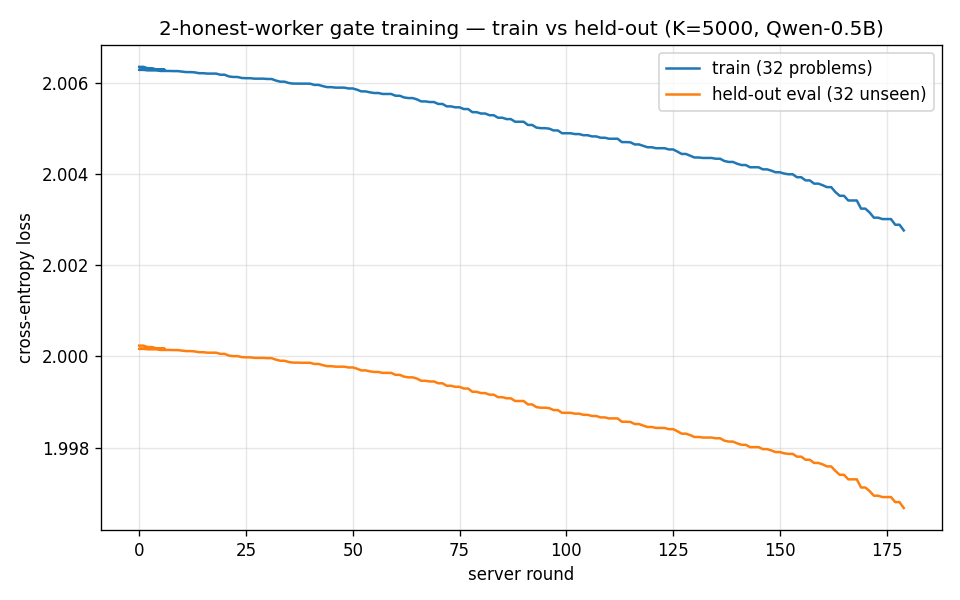

# Phase 40 — 2-honest-worker run, AFTER the per-flip-η + winner-baseline fix

Re-run of the 2-honest-worker experiment against the fixed coordinator
(deployed version `7f6b90d4`, commit `fd27a5c`). Same 32/32 disjoint corpus.

## Both fixes validated

- **No false quarantine.** 0 quarantine events in either worker (pre-fix run
  quarantined both, at rounds 159 and 179). The winner-baseline audit holds.
- **Replicas now consistent.** At *matching* rounds the two workers' losses agree
  to ~1e-4 and η is identical:

  | round | worker-0 (train / eval / η) | worker-1 (train / eval / η) |
  |---|---|---|
  | 50  | 2.005880 / 1.999758 / 0.00105   | 2.005774 / 1.999653 / 0.00105   |
  | 100 | 2.004897 / 1.998763 / 0.00188565| 2.004809 / 1.998700 / 0.00188565|
  | 150 | 2.004041 / 1.997901 / 0.00278596| 2.003972 / 1.997874 / 0.00278596|
  | 179 | 2.002765 / 1.996674 / 0.00579   | 2.002744 / 1.996645 / 0.00608   |

  vs the **pre-fix** catastrophic divergence (‖θ‖ 0.597 vs 0.408). The residual
  ~1e-4 is GPU floating-point nondeterminism across two physical T4s, not
  protocol drift.
- **η adapts and is replica-consistent**: 1e-3 → ~6e-3 (grow ~101 / shr ~64),
  identical across workers at matching rounds.

## ⚠ Correction: the pre-fix −0.0089 was a drift artifact

The pre-fix run reported held-out Δ = **−0.0089** at round 179. That was inflated
by the very replica drift this fix removes — worker-0's corrupted local θ
(‖θ‖ 0.597) showed a falsely-large *local* eval drop. **The true,
replica-consistent held-out Δ at round 179 is −0.0036** (both workers agree:
eval 2.0002 → 1.9966). The fix didn't just remove the quarantine; it corrected
an over-optimistic number. (The pre-fix RESULT2.md carries a cross-reference.)

## Honest result at round 179 (last full-rate co-trained round)

| run | held-out eval Δ | η | regime |
|---|---|---|---|
| single worker (baseline) | −0.0029 | frozen 1e-3 | half rate, 150 updates |
| 2-worker, **pre-fix** (reported) | −0.0089 | →7e-3 | **drift-inflated — retracted** |
| 2-worker, **fixed** | **−0.0036** | →5.8e-3 | full rate, replica-consistent |

So full-rate + η-adaptation gives a **modestly** steeper, still-**accelerating**,
and now **trustworthy** held-out drop (−0.0036 vs −0.0029) — not the 3× the
artifact suggested. Held-out tracks train in lockstep, no overfitting gap.

## New wrinkle: GPU-speed desync (orchestration, not protocol)

The two T4s ran at different speeds (worker-0 finished 300 iterations in 2158s
at round 180; worker-1 took 2601s). Because each worker runs a *fixed iteration
count*, the faster worker exited first and the slower one ran the tail **alone**
(half-rate) up to round 204. So this run did **not** cleanly co-train at full
rate all the way to R=300 — the clean full-rate portion is rounds 0–~180, which
is what the plot shows. To get a clean full-rate-to-300 run, the workers need to
target a shared **round count** (or wall-time / barrier), not a fixed local
iteration count.

*Reproduce: `notebooks/phase40_learning_run_2worker_kaggle.ipynb` against deployed
`7f6b90d4`. Raw: `traj-0.csv`/`traj-1.csv`; trails: `worker-0.log`/`worker-1.log`.*
