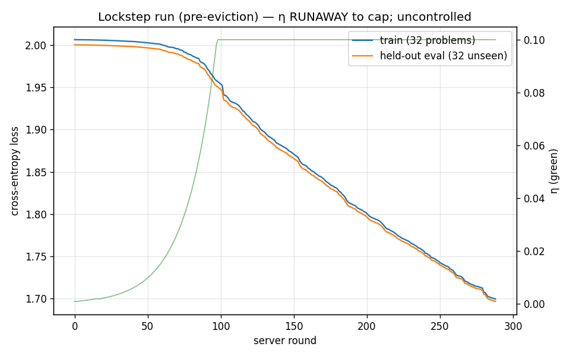

# Phase 40 — lockstep 2-worker run: η RUNAWAY (uncontrolled), two new findings

The lockstep driver did what it was meant to — deterministic full-rate
co-training, replica-consistent, **zero quarantine**, server advancing one round
per iteration. But the run is **not a clean controlled result**: it exposed an
η-adaptation instability and was cut short by a coordinator eviction. The
−0.30 held-out drop below is **real but uncontrolled** and is **not comparable**
to the η≈1e-3 baselines.

## What the auto-summary said (do not quote as the headline)

| metric | start | final (pre-eviction, r288) | Δ |
|---|---|---|---|
| train loss | 2.0064 | 1.6996 | −0.3067 |
| held-out eval loss | 2.0002 | 1.6968 | −0.3034 |

Held-out tracked train the whole way with no overfitting gap, so the descent is
genuine generalisation. **But see why this is uncontrolled ↓.**

## Finding 1 — sym-AIMD η runs away in the all-honest regime

η climbed **monotonically** to its ceiling: **282 grow events, 0 shrink events**;
η hit `ETA_MAX = 0.1` at **round 98** and stayed pinned for the remaining ~190
rounds (100× its 1e-3 init). ‖θ‖ exploded to **12.86** (vs ~0.4 in the controlled
single/2-worker runs); max |θ_i| reached 0.94 (the gate-selection design range is
`max_log_gate = 0.05`).

Root cause: with two honest workers and best-of-2 acceptance, loss decreases
*every* round → `realGlobalDelta < 0` *every* round → sym-AIMD only ever grows.
There is **no negative feedback** to stabilise η, so it saturates at the cap.
The paper's premise ("η drifts on the *imbalance* of grow vs shrink") assumed a
mix of both; in clean full-rate training there are no shrink events at all.

So the big −0.30 drop is the gate controller training at a runaway η, not at a
principled step size. The silver lining: it shows the controller **has real
capacity** for this task (a 0.30-nat generalising drop is ~100× the timid
η-frozen runs) — the conservative η was badly under-stepping. The fix is a
**stable** larger η (negative feedback / cap-aware damping / shrink-on-stall),
not letting it run to the ceiling.

## Finding 2 — coordinator evicted mid-run (in-memory DO state lost)

At iteration 289 the server round jumped **285 → 1** and η reset to 1e-3: the
Durable Object was evicted/restarted and lost its in-memory state. The local θ
was unaffected (final loss still 1.6996), but the last 11 iterations ran against
a fresh server (the flat tail in `descent3.png`; `descent3_clean.png` trims it).
This is the long-deferred **persistent-DO-state** gap, now hit in practice on a
~70-minute run.

## Honest standing of the comparison

| run | held-out Δ | η | trustworthy? |
|---|---|---|---|
| single worker | −0.0029 | frozen 1e-3 | yes (but η can't adapt solo) |
| 2-worker pre-fix | ~~−0.0089~~ | →7e-3 | no — drift artifact (retracted) |
| 2-worker fixed (T4×2) | −0.0036 @ r179 | →5.8e-3 | yes, but desynced before R=300 |
| **lockstep (this)** | −0.30 @ r288 | **runaway →0.1 cap** | **no — η uncontrolled + DO evicted** |

We still do **not** have a clean, controlled, full-rate-to-R=300 number. The
blocker is no longer orchestration (lockstep solved that) — it's the **η rule**.

## Next fixes (the real ones, proposed)

1. **Stabilise η.** Options: cap `ETA_MAX` far lower; add a shrink term on every
   step (decay) so grow/shrink balance; shrink when per-round improvement *stalls*
   or when ‖θ‖ grows too fast; or replace sym-AIMD with a step-size that doesn't
   depend on an always-negative signal. Then a controlled full-rate run gives the
   honest number.
2. **Persistent DO state** (`state.storage`) so a mid-run eviction doesn't reset
   round/η/θ — needed for any run longer than the eviction window.

*Artifacts: `descent3.png` (raw, shows the eviction tail), `descent3_clean.png`
(pre-eviction segment + η overlay), `trajectory.csv`, `run.log`. Reproduce:
`notebooks/phase40_learning_run_lockstep_kaggle.ipynb`.*

